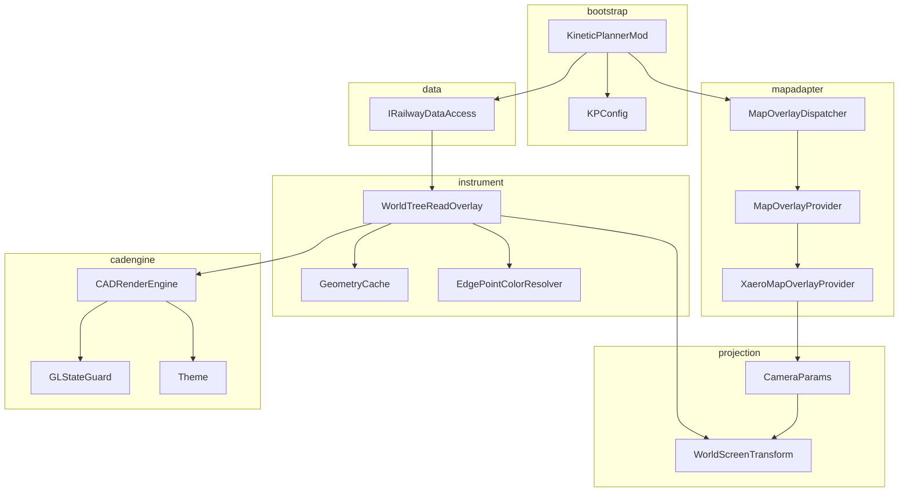

<!-- 规格文档：Kinetic Planner Phase 0 设计。已通过自审，待用户复核后转入实现计划。 -->

# Kinetic Planner - Phase 0 设计规格

**日期：** 2026-07-20
**模组：** Kinetic Planner（`kineticplanner`）
**阶段：** Phase 0 - 项目骨架 + 只读世界节点树地图叠加
**目标：** 建立数据访问层与矢量叠加渲染管线，作为后续 Phase 1-5 的地基

---

## 1. 背景与上下文

### 1.1 项目总览

Kinetic Planner 是 Minecraft 模组，用于在全屏地图模组（Xaero's World Map / JourneyMap）中以 CAD 操作思路编辑机械动力（Create）铁路。整体分阶段交付：

| 阶段 | 内容 |
|---|---|
| Phase 0 | 项目骨架 + 只读世界节点树地图叠加（本规格） |
| Phase 1 | 暂存树与基础 CAD 编辑工具 |
| Phase 2 | 高级几何（样条/双圆弧/地形拟合） |
| Phase 3 | 规划树与类 SVN 版本控制 |
| Phase 4 | 多格式 IO（CAD 原生/NBT/蓝图/Litematica） |
| Phase 5 | 远程铺设与路基模板生成 |

### 1.2 Create 铁路系统三层结构（已调研确认）

**实体层（MC 方块世界）：**
- `TrackBlock` / `TrackBlockEntity`：轨道方块，方块状态由 `TrackShape` 决定（x/z/两斜向/45°~135° 圆弧）
- `BezierConnection`：曲线连接，存于两端 BE 的 NBT，由 `bePositions`/`starts`/`axes`/`normals` 定义二次贝塞尔；Y 由 `yOffsetPixels`/`smoothing` 单独处理（故 Create 贝塞尔不支持坡度）
- 信号机/车站/观察者 BE 通过 `TrackTargetingBehaviour` 锚定到图边

**图论层（`content.trains.graph`，有向多重图）：**
- `TrackGraph`：`nodes: Map<TrackNodeLocation, TrackNode>` + `connectionsByNode: IdentityHashMap<TrackNode, Map<TrackNode, TrackEdge>>` + `edgePoints: EdgePointStorage`
- `TrackNodeLocation extends Vec3i`：**2 倍压缩整数坐标**（`floor(round(x*2))`，半方块精度）+ `dimension` + `yOffsetPixels`
- `TrackNode`：`netId + normal(Vec3) + location`
- `TrackEdge`：有向边，含 `BezierConnection turn`（空=直线）、`EdgeData`、`trackMaterial`。每对节点产生两条反向边
- `EdgeData`：`singleSignalGroup` + 有序 `points` + `intersections`
- `TrackEdgePoint`：抽象边点基类，`id/edgeLocation/position`。三种注册类型（`EdgePointType.TYPES` 注册表）：`SIGNAL`/`STATION`/`OBSERVER`，支持第三方扩展
- 图操作：`connectNodes`（建边+全局交点检测）、`transferAll`（图合并）、`findDisconnectedGraphs`（BFS 切分）

**持久化层（NBT）：**
- `RailwaySavedData extends SavedData`，存 overworld `create_tracks`，含 `trackNetworks`/`signalEdgeGroups`/`trains` 三大 Map
- `TrackGraph.write`：节点在 ListTag 中的 index 作为引用句柄；`DimensionPalette` 维度名压缩
- `BezierConnection` 序列化时相对 `localTo` BlockPos 存偏移（便于结构文件迁移）

**地图叠加层（`compat.trainmap`，非统一 API）：**
- 三个独立适配器：`XaeroTrainMap`（Mixin `@Inject` + `@Accessor`）、`JourneyTrainMap`（`@JourneyMapPlugin` + `FullscreenRenderEvent`）、`FTBChunksTrainMap`（`ScreenEvent.Render.Post` + 反射）
- 共享 `TrainMapManager.renderAndPick` + `TrainMapRenderer`（128×128 `DynamicTexture` 逐像素栅格化 + blit）
- `TrainMapSync`/`TrainMapSyncClient`：列车实时状态同步通道（客户端每 5 tick 请求，服务端推送位置/状态），Phase 0 不复用，记入后续 Phase 备忘

### 1.3 关键约束

1. Create 地图集成是三个独立适配器 + 栮格化纹理，**非统一 API**，栅格化模型不适合 CAD 矢量编辑
2. MC 1.21.1 原生 `RenderType.lines()` 线宽被 GL 钳制（通常 1px），无亚像素粗线
3. `TrackNodeLocation` 是 2 倍压缩整数，`getLocation()` 返回 `/2.0` 解压后的真实 Vec3
4. Create 的 `EdgePointType.TYPES` 是可扩展注册表，第三方模组可注册新边点类型

---

## 2. Phase 0 范围

### 2.1 范围内

- 模组骨架重命名与包结构建立
- Create `TrackGraph` 只读数据访问层（纯图拓扑，不含列车状态）
- 地图叠加适配层（`MapOverlayProvider` 抽象 + Xaero 适配器，JourneyMap 占位）
- 投影变换层（世界↔屏幕，纯数学，可单元测试）
- `CADRenderEngine`（NanoVG 封装 + GL 状态隔离 + MC 字体分层）
- 主题系统（启发式声明，视觉参数可配，语义委托 Create）
- 只读世界节点树叠加绘制器（轨道/节点/边点矢量绘制）
- 配置系统（Cloth Config + 命令）
- 单元测试（projection/theme/数据访问接口）

### 2.2 范围外（后续 Phase）

- 列车实时位置绘制（Phase 1，复用 `TrainMapSync`）
- 编辑交互/拾取/捕捉（Phase 1）
- JourneyMap 适配器实现（Phase 0.5）
- 信号段着色（Phase 3）
- 暂存树/规划树/版本控制（Phase 1/3）
- 多格式 IO（Phase 4）
- 远程铺设/路基生成（Phase 5）

---

## 3. 架构总览

### 3.1 方案选型

采用**能力域分包**（方案 B）：按 `mapadapter`/`cadengine`/`projection`/`instrument`/`data`/`config` 分包，每个能力域可独立测试，CADRenderEngine 与地图适配彻底解耦便于跨 Phase 复用。

### 3.2 包结构

```
com.jsmua.kineticplanner
├── KineticPlannerMod.java          @Mod 主类
├── KineticPlannerClient.java       @Mod(dist=CLIENT) 客户端入口
├── config/
│   ├── KPConfig.java               Cloth Config 配置根
│   └── KPCommands.java             命令注册
├── data/
│   ├── IRailwayDataAccess.java     只读访问接口
│   ├── RailwayDataAccess.java      生产实现（访问 CreateClient.RAILWAYS）
│   ├── StubRailwayDataAccess.java  测试桩
│   └── EdgeGeometry.java           边几何描述符（STRAIGHT|BEZIER）
├── mapadapter/
│   ├── MapOverlayProvider.java     接口
│   ├── MapOverlayContext.java      相机参数 + 屏幕尺寸 + 鼠标
│   ├── MapOverlayDispatcher.java   按 Mods.isLoaded 分发 + 熔断
│   └── XaeroMapOverlayProvider.java 首个实现（Mixin 接入）
├── projection/
│   ├── CameraParams.java           值对象
│   ├── WorldScreenTransform.java   纯函数变换
│   └── WorldRect.java              可见世界矩形
├── cadengine/
│   ├── CADRenderEngine.java        NanoVG 生命周期 + 帧管理
│   ├── GLStateGuard.java           save/restore MC RenderSystem
│   ├── Theme.java                  主题数据（启发式声明）
│   ├── ThemeSerializer.java        JSON 序列化
│   └── ThemeManager.java           主题加载/切换/重载
└── instrument/
    ├── WorldTreeReadOverlay.java   Phase 0 只读叠加绘制器
    ├── GeometryCache.java          几何缓存 + 脏检测
    └── EdgePointColorResolver.java 边点颜色委托 Create
```

### 3.3 组件依赖图



---

## 4. 详细设计

### 4.1 模组骨架

**重命名：**
- `gradle.properties`：`mod_id=kineticplanner`、`mod_name=Kinetic Planner`、`mod_group_id=com.jsmua.kineticplanner`
- 主类 `ExampleMod` -> `KineticPlannerMod`，客户端 `ExampleModClient` -> `KineticPlannerClient`
- 删除示例 `EXAMPLE_BLOCK`/`EXAMPLE_ITEM`/`EXAMPLE_TAB` 注册，保留 `Config` 类骨架改写为 `KPConfig`
- `neoforge.mods.toml` 添加 Create 依赖（`required`，`[6.0.10,)`）与 Xaero/JourneyMap（`optional`）

**事件订阅：**
- `KineticPlannerClient` 注册 `ClientTickEvent.Post`（驱动叠加刷新）、`InputEvent.MouseButton.Pre`（点击拾取预留）
- Mixin `@Inject` 到 `GuiMap.render` 末尾（Xaero 渲染时机）

**Mixin 配置：**
- 新建 `kineticplanner.mixins.json`，`compat` 子包放 Xaero accessor
- `neoforge.mods.toml` 启用 `[[mixins]]` 声明
- Mixin plugin 守卫 `Mods.XAEROWORLDMAP.isLoaded()`（复刻 Create `CreateMixinPlugin` 模式）
- accessor 字段名用 `kp$` 前缀，避免与 Create mixin 冲突

**依赖：** 不新增（NanoVG 由 LWJGL 自带），保留现有 Cloth Config/Create/Ponder/Flywheel/Xaero/JourneyMap 依赖

### 4.2 Create 数据只读访问层

**接口 `IRailwayDataAccess`：**
```java
public interface IRailwayDataAccess {
    Stream<TrackGraph> graphsInDimension(ResourceKey<Level> dim);
    Stream<TrackNode> nodesInDimension(TrackGraph g, ResourceKey<Level> dim);
    Stream<TrackEdge> edgesFrom(TrackNode node);
    <T extends TrackEdgePoint> Stream<T> edgePoints(TrackGraph g, EdgePointType<T> type);
    int clientVersion();
    EdgeGeometry edgeGeometry(TrackEdge edge);
    Vec3 nodeWorldPos(TrackNode node);
}
```

**只读约束：**
- 绝不调用 `addNode`/`connectNodes`/`putGraph`/`removePoint` 等 mutate 方法
- 每帧重新获取 `CreateClient.RAILWAYS.trackNetworks` 的 live view（遍历期间不修改则安全，与 Create `TrainMapManager.renderPhase` 一致）
- 维度过滤前置（`TrackNodeLocation.dimension` 匹配）

**`EdgeGeometry` 描述符：**
```java
public record EdgeGeometry(
    Type type,              // STRAIGHT | ARC | BEZIER | EXTENSION | SPLINE
    Vec3 p1, Vec3 p2,       // 端点世界坐标
    BezierSpec bezier,      // Create 原生贝塞尔（BEZIER 时非空）
    ArcSpec arc,            // 显式圆弧（ARC 时非空，CAD 友好，Phase 2）
    ExtensionSpec extension // railx 等扩展几何载体（EXTENSION 时非空，Phase 4 预留）
) {
    public record BezierSpec(
        Vec3 start, Vec3 control1, Vec3 control2, Vec3 end,  // 三次贝塞尔控制点
        TrackMaterial material
    ) {}
    public record ArcSpec(
        Vec3 center, double radius, double startRad, double endRad,
        TrackMaterial material
    ) {}
    public record ExtensionSpec(
        String sourceModId,         // "railx" 或其他扩展模组 id
        String geometryTypeId,      // 扩展几何类型 id（由源模组定义）
        CompoundTag data            // 委托源模组的序列化，未知则原样保留
    ) {}
}
```
Create 的二次贝塞尔（`BezierConnection` 由 2 端点 + 2 切向轴）在此转换为三次贝塞尔控制点，供 NanoVG `nvgBezierTo` 使用。

**Phase 0 实现约束：** `type` 仅产生 `STRAIGHT`/`BEZIER`（来自 Create 原生），`arc`/`extension` 字段恒为 null。`ARC`/`EXTENSION`/`SPLINE` 类型为后续 Phase 预留，数据结构提前就位避免破坏性修改。`EXTENSION` 用于兼容 railx（lhwdev/railx，扩展 Create 轨道几何：任意节点角度、更多曲线类型）等扩展模组的非标准几何--未知 `sourceModId` 的扩展几何保留 `data` 原样，渲染时降级为端点直线 + 标记"未知几何"，不破坏数据。

**脏检测：** `clientVersion()` 返回 `CreateClient.RAILWAYS.version`，叠加层缓存上次渲染版本，仅变化时重建几何

**测试：** `StubRailwayDataAccess` 构造内存 `TrackGraph` 供 projection/instrument 单元测试

### 4.3 地图叠加适配层

**接口 `MapOverlayProvider`：**
```java
public interface MapOverlayProvider {
    boolean isMapOpen(Screen screen);
    @Nullable MapOverlayContext captureContext(Screen screen);
    String modId();
}
```

**值对象 `MapOverlayContext`：**
```java
public record MapOverlayContext(
    ResourceKey<Level> dimension,
    double cameraBlockX, double cameraBlockZ,
    double blocksPerPixel,
    int screenWidth, int screenHeight,
    int mouseX, int mouseY,
    float partialTicks,
    boolean linearFiltering
) {}
```

**`MapOverlayDispatcher`：**
- `ClientTickEvent.Post` 遍历已注册 provider，首个 `isMapOpen` 为真的提供上下文
- 熔断：`Set<String> encounteredExceptions`（按 modId 粒度），某 provider 抛异常后记录并跳过该 provider 后续调用
- 暴露 `Optional<MapOverlayContext> currentContext()`

**`XaeroMapOverlayProvider`（Phase 0 首个实现）：**
- 接入方式：**Mixin `@Inject` 到 `GuiMap.render` 末尾**（`@At("RETURN")`），优先此方案确保渲染时机可控
- 备选：`ScreenEvent.Render.Post`（若 Mixin 注入点与 Create 冲突）
- Mixin 文件：
  - `XaeroMapAccessor`（`@Mixin(GuiMap.class)` `@Accessor`，字段名 `kp$cameraX`/`kp$cameraZ`/`kp$scale`/`kp$mapProcessor`）
  - 渲染注入 Mixin（`@Inject` 到 `render` 末尾，调用 `WorldTreeReadOverlay.onMapRender`）
- 与 Create `XaeroFullscreenMapMixin` 共存：Create 注入点是 `blit` INVOKE，我们注入点是 RETURN，位置不同可共存；NeoForge mixin 按注册顺序执行，我们的 `@Inject` 在 Create 之后
- `isMapOpen`：`screen instanceof ScreenBase sb && (sb instanceof GuiMap || sb.parent instanceof GuiMap)`
- 相机参数换算（封装在 `captureContext` 内）：
  ```
  guiScale = window.getScreenWidth() / window.getGuiScaledWidth()
  interfaceScale = window.getWidth() / window.getScreenWidth()
  blocksPerPixel = guiScale * interfaceScale / mapScale
  ```
- `dimension`：`mapProcessor.getMapWorld().getCurrentDimension().getDimId()` 转换为 `ResourceKey<Level>`

**`JourneyMapOverlayProvider`：** Phase 0 占位，`isMapOpen` 恒返回 false，留待 Phase 0.5 用 `@JourneyMapPlugin` + `FullscreenRenderEvent` 实现

### 4.4 投影变换层

**值对象 `CameraParams`：**
```java
public record CameraParams(
    double cameraBlockX, double cameraBlockZ,
    double blocksPerPixel,
    int screenWidth, int screenHeight
) {
    public int screenCenterX() { return screenWidth / 2; }
    public int screenCenterY() { return screenHeight / 2; }
}
```

**纯函数 `WorldScreenTransform`：**
```java
public final class WorldScreenTransform {
    private final CameraParams cam;
    public Vector2f worldToScreen(double worldX, double worldZ);
    public Vec2d screenToWorld(double screenX, double screenY);
    public double screenToWorldDistance(double pixelDist);
    public WorldRect visibleWorldRect();
}
```

**变换公式：**
```
screenX = (worldX - cam.cameraBlockX) / cam.blocksPerPixel + cam.screenCenterX()
screenY = (worldZ - cam.cameraBlockZ) / cam.blocksPerPixel + cam.screenCenterY()
worldX = (screenX - cam.screenCenterX()) * cam.blocksPerPixel + cam.cameraBlockX
worldZ = (screenY - cam.screenCenterY()) * cam.blocksPerPixel + cam.cameraBlockZ
```

**设计点：**
- Y 轴不处理（俯视投影，Y 仅用于图层排序与高度可视化，Phase 0 用 alpha 编码高度差异）
- `visibleWorldRect()` clamp 到 `±3.0e7`（MC 世界边界）
- 不可变，每帧从 `MapOverlayContext` 构造新实例，线程安全
- `worldToScreen` 返回 `org.joml.Vector2f`（NanoVG float），`screenToWorld` 返回 `Vec2d`（double，拾取精度）

**与 NanoVG 衔接：** `CADRenderEngine.applyWorldTransform(t)` 内部 `nvgTranslate` + `nvgScale` + `nvgTranslate`，此后所有 NanoVG 绘制用世界坐标，引擎内部自动变换。instrument 层只提供世界坐标，不关心屏幕映射。

**测试策略：**
- 纯单元测试：构造 `CameraParams`，验证 `worldToScreen` 与 `screenToWorld` 互逆（`assertClose(worldToScreen(screenToWorld(p)), p, 1e-6)`）
- 边界测试：`blocksPerPixel` 极值、世界坐标极大值、屏幕坐标负值
- 这是 Phase 0 **唯一可完整单元测试的模块**，必须达到高覆盖率

### 4.5 CADRenderEngine（NanoVG 封装 + GL 状态隔离）

**职责：** 封装 NanoVG 生命周期与帧管理，提供面向 CAD 的高层绘制 API（线段/折线/圆弧/贝塞尔/填充），隔离 NanoVG GL 状态与 MC `RenderSystem` 状态。Phase 0 技术核心难点。

**字体方案（关键决策）：** NanoVG **不创建字体**，所有文字一律走 MC 管线（`GuiGraphics` + `Font.draw`）。天然兼容 Caxton（光栅化接管）、Modern UI（字体渲染接管）等模组。CADRenderEngine 只负责矢量几何，不暴露文字绘制 API。

**NanoVG 生命周期：**
```java
public final class CADRenderEngine {
    private long vg = NVG_NOT_CONTEXT;
    private boolean inFrame = false;
    public void init();
    public void beginFrame(int width, int height, float dpr);  // save MC GL + nvgBeginFrame
    public void endFrame();                                     // nvgEndFrame + restore MC GL
    public void dispose();
}
```

**GL 状态隔离（核心安全机制）：** NanoVG 与 MC 共享同一 GL 上下文，必须 `beginFrame` 前 save、`endFrame` 后 restore。`GLStateGuard.capture()` 快照 blend/depth/cull/scissor/viewport/MC shader，`restore()` 恢复。关键：必须显式 restore MC 着色器（`RenderSystem.setShader`），否则后续 MC 渲染会崩。不调用 `glPushAttrib`/`glPopAttrib`（GL3+ 核心模式已废弃）。深度测试在叠加层关闭，`beginFrame` 前 `glDisable(GL_DEPTH_TEST)`，`endFrame` 后按快照恢复。

**NanoVG 上下文创建：** `vg = nvgCreate(NVG_ANTIALIAS | NVG_STENCIL_STROKES)`。`NVG_ANTIALIAS` 距离场抗锯齿（核心需求），`NVG_STENCIL_STROKES` 粗线 join/cap 用 stencil 缓冲（双圆弧/样条必需）。

**与投影层衔接：** `applyWorldTransform(t)` 内 `nvgSave` + `nvgTranslate(screenCenter)` + `nvgScale(1/blocksPerPixel)` + `nvgTranslate(-cameraBlockX, -cameraBlockZ)`，`restoreWorldTransform()` 调 `nvgRestore`。

**高层绘制 API：**
```java
public void drawLine(double x1, double z1, double x2, double z2, Theme.GeometryStyle style, int color);
public void drawPolyline(List<Vec2d> pts, boolean closed, Theme.GeometryStyle style, int color);
public void drawBezier(Vec2d p0, Vec2d p1, Vec2d p2, Vec2d p3, Theme.GeometryStyle style, int color);
public void drawArc(Vec2d center, double radius, double startRad, double endRad, Theme.GeometryStyle style, int color);
public void drawFilledCircle(Vec2d center, double radius, int fillColor, Theme.GeometryStyle outlineStyle, int outlineColor);
public void drawFilledPolygon(List<Vec2d> pts, int fillColor);
```
- `color` 参数由 instrument 层查询 Create 提供，引擎不解析颜色
- `Theme.GeometryStyle.width` 是世界单位；`constantScreenLineWidth` 模式下引擎 `nvgStrokeWidth(width / blocksPerPixel)` 转固定屏幕像素，否则 `nvgStrokeWidth(width)` 随缩放
- 贝塞尔：Create 二次贝塞尔经 `EdgeGeometry` 转三次贝塞尔控制点，用 `nvgBezierTo`，无需手动细分

**视锥剔除：** 引擎不内置（保持纯渲染职责），由 instrument 层用 `WorldScreenTransform.visibleWorldRect()` 判定

**故障安全：** `beginFrame`/`endFrame` 任何异常都 `try-finally` 确保 `endFrame` 调用。`init` 失败（NanoVG 返回 0）则引擎进入 `disabled` 状态，叠加层降级不绘制 + 日志告警

**测试：** `GLStateGuard` 快照/恢复逻辑抽提为纯函数可 mock 测试；`applyWorldTransform` 矩阵计算可无 GL 环境验证；整体渲染靠手动可视化验收

### 4.6 主题系统（启发式声明，委托 Create）

**核心原则：** 主题"启发式声明"--视觉参数（线宽/线型/透明度）动态可配，但语义标签来自 Create 数据本身。主题只管"怎么画"，不管"画什么"。大量委托 Create 逻辑（信号分割、POI 查询、图颜色），减少工作量且不破坏未知扩展。

**数据结构（精简，颜色字段全部移除，由 instrument 层查询 Create）：**
```java
public record Theme(
    String name,
    GeometryStyle track,          // 线宽/线型/透明度，颜色来自 TrackGraph.color
    GeometryStyle node,           // 节点外圈样式，填充色来自 TrackGraph.color
    GeometryStyle edgePoint,      // 边点通用样式，颜色委托 Create
    BezierHandleStyle bezier,     // 控制点/控制多边形（Phase 0 默认隐藏）
    LayerVisibility layers,
    GlobalStyle global
) {
    public record GeometryStyle(float width, LineCap cap, LineJoin join, boolean dashed, float dashPattern, float alpha) {}
    public record BezierHandleStyle(float controlPointRadius, float polygonWidth, boolean dashed, boolean showByDefault) {}
    public record LayerVisibility(boolean tracks, boolean nodes, boolean bezierHandles, boolean edgePoints) {}
    public record GlobalStyle(float minZoomBlocksPerPixel, float maxZoomBlocksPerPixel, boolean constantScreenLineWidth, float fixedScreenLineWidthPx) {}
}
```

**颜色委托策略（instrument 层 `EdgePointColorResolver` 实现）：**
- 轨道线颜色：`graph.color.getRGB()`（`TrackGraph.color` 的 `Color.rainbowColor`）
- 节点颜色：混合 `graph.color` 与白（复刻 `TrackGraphVisualizer` 的 `Color.mixColors(Color.WHITE, graph.color, 1)`）
- 边点颜色：信号机（`SignalBoundary`）查 `SignalEdgeGroup.color`；车站（`GlobalStation`）用 `StationBlock` mapColor；观察者（`TrackObserver`）用 `TrackGraph.color`；未知类型 fallback `graph.color`（保证第三方 `EdgePointType` 扩展也能显示）

**Phase 0 默认主题：** track.width 0.4 实线 alpha 1.0；node.width 0.05 radius 0.3；edgePoint.width 0.05 radius 0.25；bezier.showByDefault false；layers tracks/nodes/edgePoints=true, bezierHandles=false；global minZoom 0.05 maxZoom 5.0 constantScreenLineWidth true fixedScreenLineWidthPx 2.0

**线宽模式：** `constantScreenLineWidth=true`（默认）引擎 `nvgStrokeWidth(themeWidth / blocksPerPixel)` 固定屏幕像素；`false` 则 `nvgStrokeWidth(themeWidth)` 世界单位随缩放

**持久化：** JSON `config/kineticplanner/themes/default.json`，Gson 序列化。启动时读，缺失写默认。Phase 0 仅 `/kp theme reload` 命令重载，Phase 1+ 接入 Cloth Config 图形化编辑

**测试：** `Theme` 纯数据 record，序列化往返测试 + 默认主题合法性校验

### 4.7 只读世界节点树叠加绘制器

**职责：** `WorldTreeReadOverlay` 是 Phase 0 顶层编排器，整合 `IRailwayDataAccess` + `WorldScreenTransform` + `CADRenderEngine` + `Theme`，把 Create 当前维度的 `TrackGraph` 静态拓扑以 CAD 矢量方式叠加到地图。是 Phase 1 编辑器基类雏形。

**生命周期（每帧）：**
```
ClientTickEvent.Post:
  1. dispatcher.currentContext() -> Optional<MapOverlayContext>
  2. 若空（地图未开）：跳过
  3. 构造 CameraParams + WorldScreenTransform
  4. 脏检测：dataAccess.clientVersion() == lastRenderedVersion ? 复用几何缓存 : 重建
  5. 视锥剔除：transform.visibleWorldRect() 过滤可见节点/边

Mixin @Inject GuiMap.render 末尾:
  6. 若 context 有效：
     a. engine.beginFrame(screenW, screenH, dpr)
     b. engine.applyWorldTransform(transform)
     c. 按图层顺序绘制
     d. engine.restoreWorldTransform()
     e. engine.endFrame()
     f. MC 文字层：GuiGraphics + Font 绘制节点/车站 label（屏幕坐标）
```

**图层绘制顺序（后绘制覆盖前）：**
1. **轨道层**（`layers.tracks`）：遍历 `dataAccess.graphsInDimension(dim)`，每图遍历边，去重（`hashCode` 比较，复刻 `TrainMapManager.renderPhase` 的 `other.hashCode() > hashCode` 跳过）。直线调 `engine.drawLine`，贝塞尔调 `engine.drawBezier`。颜色委托 `graph.color`
2. **节点层**（`layers.nodes`）：遍历节点，`engine.drawFilledCircle`（填充 `graph.color`，外圈白色）。视锥外的跳过
3. **边点层**（`layers.edgePoints`）：遍历 `EdgePointType.TYPES.values()` 注册表所有类型，`graph.getPoints(type)` 获取，定位到边上的世界坐标（`edge.getPosition(graph, point.getLocationOn(edge)/edge.getLength())`），`engine.drawFilledCircle`。颜色委托 `EdgePointColorResolver`
4. **MC 文字层**：节点 netId/车站名，`font.draw` 屏幕坐标，仅当缩放足够大（`blocksPerPixel < threshold`）才绘制，避免拥挤

**几何缓存（`GeometryCache`）：**
- `Map<UUID graphId, GraphGeometry>`，`GraphGeometry` 含节点 `List<Vec3>` + 边 `List<EdgeGeometry>`
- 脏检测 key：`(clientVersion, dimension)`。版本号变或维度切换则重建
- 地图关闭时清空（释放内存）

**EdgePoint 通用处理（委托 Create 扩展性）：**
- 不硬编码三种 EdgePointType，遍历 `EdgePointType.TYPES.values()` 注册表
- 颜色解析委托 `EdgePointColorResolver.resolve(point, graph)`，未知类型 fallback 到 `graph.color`
- 图标形状：Phase 0 统一用圆形；Phase 1 按类型用不同符号，图标资源走 MC `GuiGraphics`

**性能：**
- 单维度节点数通常 < 1000，每帧 NanoVG 路径数 < 5000，可接受
- 视锥剔除在几何缓存重建时做一次，绘制时只遍历可见集
- 贝塞尔用 NanoVG 原生 `nvgBezierTo`（三次贝塞尔），无需手动细分，比 Create 折线更平滑

**开关与降级：**
- `KPConfig.overlayEnabled` 全局开关，false 时整个 overlay 不绘制
- 引擎 `disabled` 状态（NanoVG 初始化失败）时，overlay 降级为不绘制 + 日志告警

**Phase 0 不实现（明确边界）：** 列车实时位置（Phase 1）、节点/边拾取与交互（Phase 1）、信号段着色（Phase 3）、暂存树/规划树（Phase 1/3）、多格式 IO（Phase 4）、捕捉/编辑工具（Phase 1/2）

### 4.8 配置与开关

**配置文件：** `config/kineticplanner-client.toml`（仅客户端配置）

**配置树：**
```toml
[overlay]
enabled = true
adapterPriority = ["xaero", "journeymap"]  # Phase 0 仅 xaero 可用

[theme]
activeTheme = "default"
constantScreenLineWidth = true
fixedScreenLineWidthPx = 2.0
minZoomBlocksPerPixel = 0.05
maxZoomBlocksPerPixel = 5.0

[layers]
tracks = true
nodes = true
bezierHandles = false
edgePoints = true

[label]
showNodeLabels = false
showStationNames = true
labelMinZoomBlocksPerPixel = 1.0

[debug]
showFps = false
showGeometryCount = false
disableGlStateGuard = false  # 危险：跳过 GL 状态隔离（调试用）
```

**配置项与 Theme 关系：**
- `[overlay]`/`[layers]`/`[debug]` 是运行时开关，直接驱动 instrument 层
- `[theme]` 项是 `Theme.GlobalStyle` 的快捷覆盖（优先级高于主题文件，便于不编辑 JSON 快速调参）
- 主题的 `GeometryStyle`（线宽/线型）由 `config/kineticplanner/themes/<name>.json` 定义

**命令：**
- `/kp overlay toggle` - 切换叠加开关
- `/kp overlay reload` - 重载配置 + 主题
- `/kp theme reload` - 仅重载主题
- `/kp theme list` - 列出可用主题
- `/kp debug stats` - 输出当前帧渲染统计

**配置 UI：** Phase 0 通过 `IConfigScreenFactory` 注册 Cloth Config 屏幕（复刻现有 `ExampleModClient` 的 `ConfigurationScreen::new` 模式，改用 Cloth Config `ConfigBuilder`）。提供基础开关 + 主题选择下拉，不提供主题编辑器（Phase 1）

---

## 5. Phase 0 验收标准

### 5.1 功能验收（手动可视化）

1. 装载 Create + Xaero's World Map + 本模组，进入存档有铁路
2. 打开 Xaero 全屏地图，叠加层自动显示当前维度轨道拓扑
3. 轨道以 Create `TrackGraph.color` 着色（每图一色），直线与贝塞尔曲线平滑抗锯齿
4. 节点以圆点显示（填充图色 + 白色外圈）
5. 车站/信号机/观察者以彩色圆点显示，颜色委托 Create（信号机用 `SignalEdgeGroup.color`）
6. 地图缩放时，叠加层正确缩放（线宽按 `constantScreenLineWidth` 配置固定或随缩放）
7. 地图平移时，叠加层跟随平移，无滞后
8. 切换维度（Xaero 切换维度视图），叠加层自动切换到对应维度数据
9. 在地图上建造/拆除轨道（关闭地图再打开），叠加层反映变化（脏检测生效）
10. 关闭叠加开关（配置或 `/kp overlay toggle`），叠加层消失，地图其他功能不受影响
11. 车站名标签在足够缩放时显示，缩太小不显示
12. 字体由 MC 管线渲染（兼容 Caxton/Modern UI 等）

### 5.2 隔离与稳定性验收

13. NanoVG 初始化失败时（模拟：删 LWJGL native），模组不崩溃，叠加层降级为不绘制 + 日志告警
14. Xaero Mixin 注入失败时（Xaero 版本不兼容），`MapOverlayDispatcher` 熔断该 provider，不崩溃，其他功能正常
15. 叠加层渲染异常时（模拟：构造错误几何），`try-finally` 保证 `endFrame` 调用，MC 后续渲染不受影响
16. Create 叠加层（`showTrainMapOverlay`）与本模组叠加层**共存**，不互相干扰（Create 画其栅格化纹理 + 列车，我们画矢量拓扑）

### 5.3 性能验收

17. 单维度 < 500 节点时，叠加层渲染帧耗时 < 2ms（debug 统计验证）
18. 地图缩放/平移无明显卡顿（60fps 稳定）
19. 地图关闭后，几何缓存释放，内存无持续增长

### 5.4 架构验收

20. `IRailwayDataAccess` 接口与实现分离，`StubRailwayDataAccess` 可用于 projection/instrument 单元测试
21. `WorldScreenTransform` 纯单元测试通过（互逆性、边界）
22. `Theme` 序列化往返测试通过
23. 包结构符合章节 3.2 定义，无跨层直接依赖（如 instrument 不直接访问 Create 类，必须经 `IRailwayDataAccess`）

### 5.5 明确不在 Phase 0 验收范围

- 列车实时位置（Phase 1）
- 编辑交互（Phase 1）
- JourneyMap 适配器（Phase 0.5）
- 信号段着色（Phase 3）
- 多格式 IO（Phase 4）

---

## 6. 后续 Phase 备忘

- **Phase 1 列车实时位置：** 复用 Create `TrainMapSync`/`TrainMapSyncClient` 同步通道。客户端 `requestData()` 每 5 tick 请求，`currentData: Map<UUID, TrainMapSyncEntry>` 含每车厢双转向架位置 + 状态。请求去重：若 Create 叠加已开启且在请求，不重复调用 `requestData()`，直接读 `currentData`；否则自己驱动请求。`TrainMapSyncEntry.getPosition(carriageIndex, firstBogey, time)` 做 prev/cur 插值，`time = (tick - lastPacket)/lightPacketInterval`
- **Phase 3 信号段着色：** 委托 `EdgeData.getGroupAtPosition(graph, position)` + `SignalEdgeGroup.color`，主题不定义信号段颜色
- **Phase 4 多格式 IO：** `BezierConnection` 序列化时相对 `localTo` BlockPos 存偏移（便于结构文件迁移），与 Create 蓝图/Litematica 兼容；`TrackGraph.write` 的 index 引用句柄 + `DimensionPalette` 压缩是 NBT 格式基础
- **Phase 1 编辑器：** `WorldTreeReadOverlay` 是其基类雏形，`CADRenderEngine` 跨 Phase 复用，`WorldScreenTransform` 的 `screenToWorld` 与 `screenToWorldDistance` 支撑节点捕捉
- **EdgePointType 扩展：** 第三方模组注册的 `EdgePointType` 通过遍历 `EdgePointType.TYPES.values()` 自动显示，未知类型 fallback 到 `graph.color`

---

## 7. 外部 DSL 与 railx 兼容性（Phase 4 备忘，不进入 Phase 0 验收）

### 7.1 内外部 DSL 分层

- **内部 DSL：** Create 数据结构（`TrackGraph`/`TrackNode`/`TrackEdge`/`BezierConnection`/`EdgePoint`），Phase 0 的 `EdgeGeometry` 描述符已预留 `ExtensionSpec` 字段承载 railx 等扩展几何
- **外部 DSL：** **IFC 4.3 铁路特化子集**（buildingSMART IFC 4.3, ISO 16739-1）。选型理由：
  - IFC 4.3 是**完全开放的国际标准**（ISO 16739-1），4.3 版本正式纳入铁路域（`IfcRailway`/`IfcTrack`/`IfcAlignment`/`IfcBSplineCurve`），许可无约束
  - 中国铁路 BIM 标准基于 IFC 体系，互操作生态更广
  - 核心交换层用标准 IFC 实体（IFC-XML 序列化），确保被任何 IFC 兼容软件识别
  - Create 特有的有向多重图、2 倍压缩坐标、贝塞尔控制点、railx 扩展几何、三树元数据等信息**不进入 IFC 标准实体**，而是通过 `IfcPropertySet` 自定义属性集承载（`kp_` 前缀命名空间），作为标准交换之上的 Create 特化层
  - 双层设计替代了原方案中的 RailML（非 ISO 开放标准，RailML 词汇全面弃用，改用 IFC 实体 + PSet）

### 7.2 IFC 4.3 rail 子集与 Create 数据结构映射

| IFC 4.3 实体 | Create 对应 | 说明 |
|---|---|---|
| `IfcRailway` | `RailwaySavedData` | 顶层铁路聚合容器，通过 `Aggregates` 包含所有 `IfcTrack` |
| `IfcTrack` 段 | `TrackEdge`（含两端 `TrackNode`） | 每条有向边映射为一个 `IfcTrack` 段实例 |
| `IfcReferent`（PredefinedType=CONNECTIONPOINT） | `TrackNode` | 段端点标记，位于 `IfcTrack` 的 `IsNestedBy` 集合中 |
| `IfcRelConnectsPathElements` | 节点间有向连接关系 | 表达两个 `IfcReferent` 间的有向路径连接；多重边靠多个关系实例区分；自带 `RelatingPriorities` 等方向性属性（原属结构层，语义借用） |
| `IfcBSplineCurveWithKnots`（Degree=3） | `EdgeGeometry.type=BEZIER`（Create 三次贝塞尔） | 精确表达 4 控制点三次贝塞尔，标准层无损，无需降级采样 |
| `IfcLineSegment` | `EdgeGeometry.type=STRAIGHT` | 直线段直接映射 |
| `IfcPropertySet`（Name=`kp_Signal`） | `SignalBoundary`（`EdgePointType.SIGNAL`） | 信号机：`IfcReferent`（PredefinedType=SIGNAL）+ `kp_Signal` PSet（含 `kp_BoundaryType`/`kp_EdgeLocation`） |
| `IfcPropertySet`（Name=`kp_Station`） | `GlobalStation`（`EdgePointType.STATION`） | 车站：`IfcReferent`（PredefinedType=STATION）+ `kp_Station` PSet（含 `kp_StationName`/`kp_Assembling`） |
| `IfcPropertySet`（Name=`kp_Observer`） | `TrackObserver`（`EdgePointType.OBSERVER`） | 观察者：`IfcReferent`（PredefinedType=OBSERVATIONPOINT）+ `kp_Observer` PSet（含 `kp_Activated`/`kp_Filter`） |
| `IfcPropertySet`（Name=`kp_CreateEdge`） | `TrackEdge` 扩展数据 | 有向性（`kp_Direction`）、`netId`、`trackMaterial`、贝塞尔原始控制点、多重边序号（`kp_MultiEdgeIndex`） |
| `IfcPropertySet`（Name=`kp_NodeLocation`） | `TrackNodeLocation` | 2 倍压缩整数坐标（`kp_Loc`）、`dimension`（`kp_Dim`）、`yOffsetPixels` |
| `IfcPropertySet`（Name=`kp_TreeMeta`） | 三树元数据（Phase 3） | `kp_TreeType`（world/staging/planning）、`kp_Revision`、`kp_ParentUuid`、`kp_TechSpec` |

> **方向与多重边策略：** `IfcRelConnectsPathElements` 表达基本有向连接（节点 A→B），`kp_CreateEdge` PSet 中 `kp_Direction` 字段显式记录方向枚举（A_TO_B / B_TO_A）；两节点间反向边由不同 `IfcTrack` 段实例 + 独立 `IfcRelConnectsPathElements` 实例表达，`kp_MultiEdgeIndex` 区分同节点对内的多条边。

### 7.3 IFC-XML 双层序列化示例

核心交换层用标准 IFC-XML（`ifcXML4`，基于 IFC 4.3 规范），Create 特化层用 `IfcPropertySet` 自定义属性集（`kp_` 前缀）：

```xml
<?xml version="1.0" encoding="UTF-8"?>
<ifc xmlns="http://www.buildingsmart-tech.org/ifc/I.4.3"
     xmlns:kp="https://jsmua.com/kineticplanner/v1">

  <!-- 核心层：IfcRailway 聚合体，标准 IFC 实体，任何 IFC 兼容软件可读 -->
  <IfcRailway id="rp1" Name="TrackGraph_net1" Description="Create railway network">
    <Aggregates>

      <!-- TrackEdge → IfcTrack 段，两端 IfcReferent 标记端点 -->
      <IfcTrack id="tr1" Name="edge_0x1A2B" Description="Create track edge">
        <IsNestedBy>
          <IfcReferent id="rf1" Name="node_A" PredefinedType="CONNECTIONPOINT"/>
          <IfcReferent id="rf2" Name="node_B" PredefinedType="CONNECTIONPOINT"/>
        </IsNestedBy>
        <Representation>
          <!-- 三次贝塞尔：IfcBSplineCurveWithKnots，标准层精确表达 -->
          <IfcBSplineCurveWithKnots id="bs1" Degree="3"
            ControlPointsList="(10.5,64.0,-20.5) (15.0,64.0,-22.0) (25.0,64.0,-28.0) (30.5,64.0,-30.5)"
            KnotMultiplicities="4 4"
            Knots="0.0 1.0"
            CurveForm="3"/>
        </Representation>

        <!-- Create 特化层：IfcPropertySet 承载 Create 特有数据 -->
        <HasPropertySets>
          <IfcPropertySet Name="kp_CreateEdge">
            <HasProperties>
              <IfcPropertySingleValue Name="kp_NetId" NominalValue="0x1A2B"/>
              <IfcPropertySingleValue Name="kp_Direction" NominalValue="A_TO_B"/>
              <IfcPropertySingleValue Name="kp_TrackMaterial" NominalValue="create:track"/>
              <IfcPropertySingleValue Name="kp_MultiEdgeIndex" NominalValue="0"/>
              <IfcPropertyListValue Name="kp_BezierHandles">
                <ListValues>
                  <IfcReal>15.0,64.0,-22.0</IfcReal>
                  <IfcReal>25.0,64.0,-28.0</IfcReal>
                </ListValues>
              </IfcPropertyListValue>
            </HasProperties>
          </IfcPropertySet>
        </HasPropertySets>
      </IfcTrack>

    </Aggregates>
  </IfcRailway>

  <!-- 节点坐标映射（Create 2 倍压缩整数 + DimensionPalette） -->
  <IfcPropertySet Name="kp_NodeLocations">
    <HasProperties>
      <IfcPropertyListValue Name="kp_Nodes">
        <ListValues>
          <IfcText>{"id":"n1","loc":"128,64,-256","dim":0,"yOffsetPixels":0}</IfcText>
          <IfcText>{"id":"n2","loc":"192,64,-320","dim":0,"yOffsetPixels":0}</IfcText>
        </ListValues>
      </IfcPropertyListValue>
      <IfcPropertyListValue Name="kp_Dimensions">
        <ListValues>
          <IfcText>minecraft:overworld</IfcText>
          <IfcText>minecraft:the_nether</IfcText>
        </ListValues>
      </IfcPropertyListValue>
    </HasProperties>
  </IfcPropertySet>

  <!-- 有向连接关系：IfcRelConnectsPathElements -->
  <IfcRelConnectsPathElements id="rc1" Name="connect_A_to_B"
    RelatingElement="rf1" RelatedElement="rf2"
    RelatedConnectionType="ATSTART" RelatingConnectionType="ATEND"/>

  <!-- Signal: IfcReferent + kp_Signal PSet -->
  <IfcReferent id="rf3" Name="sig_e1_0.5" PredefinedType="SIGNAL">
    <!-- IfcPropertySet ... kp_Signal -->
  </IfcReferent>

</ifc>
```

- **核心层**（`IfcRailway`/`IfcTrack`/`IfcReferent`/`IfcRelConnectsPathElements`/`IfcBSplineCurveWithKnots`）：标准 IFC 实体，任何 IFC 4.3 兼容铁路软件可读拓扑与几何
- **特化层**（`IfcPropertySet` 以 `kp_` 命名）：Create 特有数据（2 倍压缩坐标、贝塞尔原始控制点、railx 扩展几何、三树元数据、技规），仅本模组读写
- 第三方铁路软件忽略不识别的 `IfcPropertySet`，仍能读取核心拓扑与线形

### 7.4 railx 兼容性策略

railx（lhwdev/railx）扩展 Create 轨道几何：任意节点角度、更多曲线类型。兼容策略：

1. **数据保留优先：** `EdgeGeometry.ExtensionSpec` 存储原始 railx 几何数据（`sourceModId="railx"` + `geometryTypeId` + `CompoundTag data`），不尝试解析其内部结构
2. **railx 加载时：** 通过反射或 railx API（若提供）将 `ExtensionSpec.data` 还原为 railx 几何对象，正常渲染与编辑
3. **railx 未加载时：** 渲染降级为端点直线 + 标记"未知几何（railx）"，数据不丢失；IFC 导出时原始数据存入 `kp_ExtensionGeometry` PSet 原样保留
4. **远程铺设（Phase 5）：** railx 几何无法直接铺设到 Create 世界（Create 不支持其曲线类型），需 discreteize 为 Create 可接受的贝塞尔段，或在 railx 存在时委托 railx 铺设
5. **IFC 导出：** railx 扩展几何在 IFC 中通过 `IfcPropertySet`（`kp_ExtensionGeometry`）表达原始数据，核心层降级为 `IfcBSplineCurveWithKnots` 采点（保证主流 IFC 软件可见线形）

### 7.5 几何类型映射表

| 内部 DSL `EdgeGeometry.type` | IFC 4.3 标准实体 | IFC 特化层（PSet） | 备注 |
|---|---|---|---|
| `STRAIGHT` | `IfcLineSegment` | - | 直接映射 |
| `ARC` | `IfcAlignmentHorizontalSegment`（Phase 2） | - | 圆心/半径/角度，Phase 2 实现 |
| `BEZIER`（Create 三次） | `IfcBSplineCurveWithKnots`（Degree=3, ControlPointsList=4 点, KnotMultiplicities="4 4"） | `kp_CreateEdge.kp_BezierHandles` 存原始控制点 | 标准层精确表达，无需降级采样 |
| `EXTENSION`（railx 等） | 降级 `IfcBSplineCurveWithKnots` 采点 | `kp_ExtensionGeometry` PSet 存原始数据 | 原始数据在 PSet 保留 |
| `SPLINE`（Phase 2） | `IfcBSplineCurveWithKnots`（Degree=3..5） | `kp_SplineControlPoints` PSet 存完整控制点 | 精确表达，标准层可读 |

> 相比原 RailML 方案，`BEZIER` 不再需要"降级 `<linear>` 采样 + `kp:` 扩展"双轨——`IfcBSplineCurveWithKnots` 在标准层即提供三次贝塞尔的精确表达，大幅简化序列化逻辑。

### 7.6 与其他格式互导

- **Create NBT：** 双向 1:1（内部 DSL 直接读写），世界树零损失
- **Create 蓝图/Litematica：** 单向导入，仅提取线路几何（`BezierConnection` 相对坐标还原），丢失信号/车站 EdgePoint
- **IFC 4.3 rail 子集：** 双向，核心层（标准 IFC 实体）被主流 IFC 软件识别，`kp_` PSet 特化层仅本模组读写
- **LandXML/DXF：** Phase 4 后期可选导出。DXF 从 IFC 核心层几何转换；LandXML（道路/铁路交换格式）若需支持则从 IFC 核心对齐层转换。不在初版范围

### 7.7 IfcExchangeAdapter 接口与最小子集（Phase 4 实现备忘）

Phase 0 不实现 IO，但定义抽象交换适配器接口，为 Phase 4 预留扩展点。接口与实现推迟到 Phase 4 动手时完成，此处仅声明最小 IFC 4.3 rail 子集：

```java
/**
 * IFC 4.3 rail 子集交换适配器。Phase 4 实现。
 * 负责 Create TrackGraph ↔ IFC 4.3 rail 子集（IFC-XML）的双向转换。
 */
@ApiStatus.Experimental
public interface IfcExchangeAdapter {

    /** 将 TrackGraph 导出为 IFC-XML 字符串（双层结构）。 */
    String exportGraph(TrackGraph graph);

    /** 从 IFC-XML 字符串导入 TrackGraph（在暂存树/规划树中重建）。 */
    TrackGraph importGraph(String ifcXml);
}
```

**最小子集实体清单（约 12 个 IFC 实体）：**

| # | IFC 4.3 实体 | 用途 | Phase 4 必选 |
|---|---|---|---|
| 1 | `IfcRailway` | 铁路聚合容器 | ✅ |
| 2 | `IfcTrack` | 轨道段（对应 TrackEdge） | ✅ |
| 3 | `IfcReferent` | 轨道段端点标记（CONNECTIONPOINT/SIGNAL/STATION/OBSERVATIONPOINT） | ✅ |
| 4 | `IfcRelConnectsPathElements` | 有向路径连接关系 | ✅ |
| 5 | `IfcBSplineCurveWithKnots` | 三次贝塞尔精确表达 | ✅ |
| 6 | `IfcLineSegment` | 直线段几何 | ✅ |
| 7 | `IfcPropertySet` | 自定义属性集容器（`kp_` 命名） | ✅ |
| 8 | `IfcPropertySingleValue` | 单值属性 | ✅ |
| 9 | `IfcPropertyListValue` | 列表值属性 | ✅ |
| 10 | `IfcPropertyEnumeratedValue` | 枚举值属性 | ✅ |
| 11 | `IfcAlignmentHorizontalSegment` | 水平对齐段（Phase 2，ARC 类型） | 🟡 Phase 2 |
| 12 | `IfcCompositeCurve` | 复合曲线（Phase 2+，多段拼接） | 🟡 Phase 2+ |

序列化格式固定为 **IFC-XML**（`ifcXML4`），不采用 IFC-SPF（STEP p21），理由：
- IFC-XML 易于 XML 解析器直接处理，MC 环境下无需引入 STEP 解析库
- XML 可读性强，便于调试与手工验证
- 体积略大于 SPF 但 MC 模组场景下 IO 量级不大（典型铁路网络 < 1000 条边），可接受

> **注意：** `IfcExchangeAdapter` 接口在 Phase 0 只定义签名，不实现任何方法。Phase 4 动手时再选定具体解析策略（JAXB / 手写 SAX / 轻量 XML 库），避免过早绑定。

### 7.8 Phase 0 预留点

- `EdgeGeometry.ExtensionSpec` 数据结构已就位（4.2 节），Phase 0 实现时恒为 null
- `EdgePointType.TYPES` 遍历策略（4.7 节）已保证未知 EdgePoint 类型不丢失，railx 若扩展 EdgePoint 同样兼容
- `IfcExchangeAdapter` 接口已定义签名（本章 §7.7），Phase 0 不实现
- Phase 0 不实现任何 IO，但数据结构设计已考虑 IFC 4.3 rail 子集互导与 railx 兼容